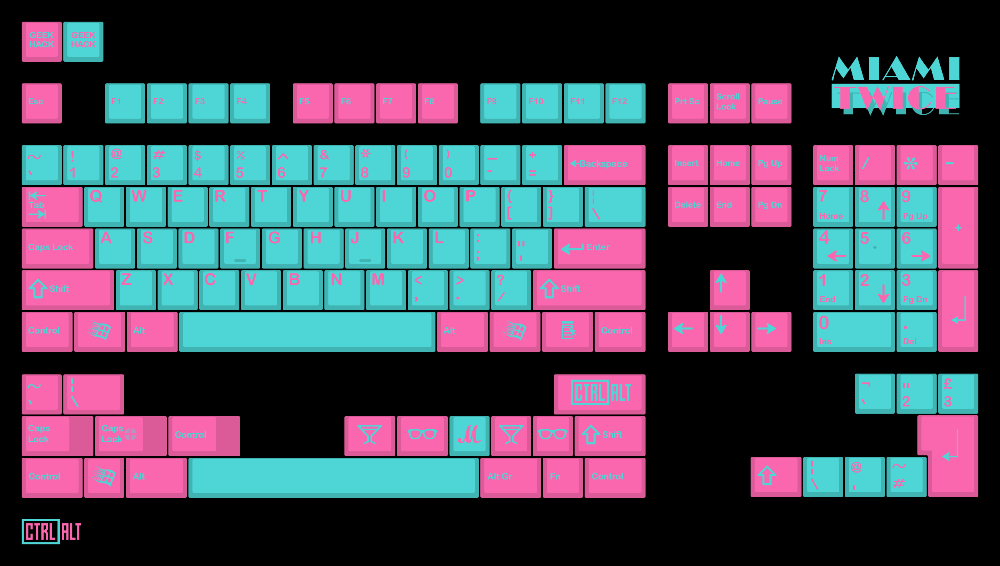

# Kaleidoscope-LEDEffects

![status][st:stable] [![Build Status][travis:image]][travis:status]

 [travis:image]: https://travis-ci.org/keyboardio/Kaleidoscope-LEDEffects.svg?branch=master
 [travis:status]: https://travis-ci.org/keyboardio/Kaleidoscope-LEDEffects

 [st:stable]: https://img.shields.io/badge/stable-✔-black.svg?style=flat&colorA=44cc11&colorB=494e52
 [st:broken]: https://img.shields.io/badge/broken-X-black.svg?style=flat&colorA=e05d44&colorB=494e52
 [st:experimental]: https://img.shields.io/badge/experimental----black.svg?style=flat&colorA=dfb317&colorB=494e52

The `LEDEffects` plugin provides a selection of LED effects, each of them fairly
simple, simple enough to not need a plugin of their own.

## Using the plugin

There are a number of different effects included in the package, all of them are
available once including the header, and one's free to choose any number of
them.

```c++
#include <Kaleidoscope.h>
#include <Kaleidoscope-LEDEffects.h>

void setup(void) {
  Kaleidoscope.use(&JukeBoxEffect);

  Kaleidoscope.setup();
}
```

## Included effects

All of these effects will scan the active layers, and apply effects based on
what keys are active on each position, thus, it needs no hints or configuration
to figure out our layout!

### `MiamiEffect`

Applies a color effect to the keyboard, inspired by the popular Miami keyset:



Alphas, punctuation, numbers, the space bar, the numbers and the dot on the
keypad, and half the function keys will be in a cyan-ish color, the rest in
magenta.

### `JukeboxEffect`

Applies a color effect to the keyboard, inspired by the JukeBox keyset:


Alphas, punctuation, numbers, the space bar, the numbers and the dot on the
keypad, and half the function keys will be in a beige-ish color, the rest in
light green, except for the `Esc` key, which will be in red.

An alternative color scheme exists under the `JukeboxAlternateEffect` name,
where the light green and red colors are swapped.

## Plugin methods

The plugin provides a single method on each of the included effect objects:

### `.activate()`

> When called, immediately activates the effect. Mostly useful in the `setup()`
> method of the Sketch, or in macros that are meant to switch to the selected
> effect, no matter where we are in the list.

## Dependencies

* [Kaleidoscope-LEDControl](https://github.com/keyboardio/Kaleidoscope-LEDControl)

## Further reading

Starting from the [example][plugin:example] is the recommended way of getting
started with the plugin.

 [plugin:example]: https://github.com/keyboardio/Kaleidoscope-LEDEffects/blob/master/examples/LEDEffects/LEDEffects.ino
